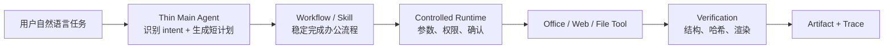
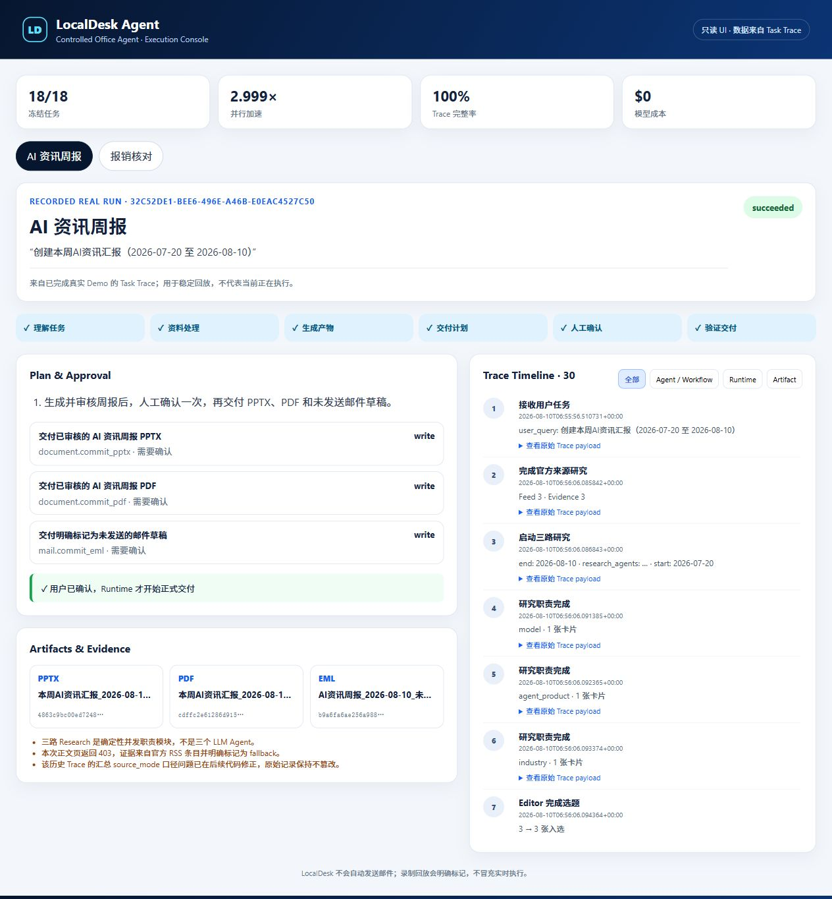
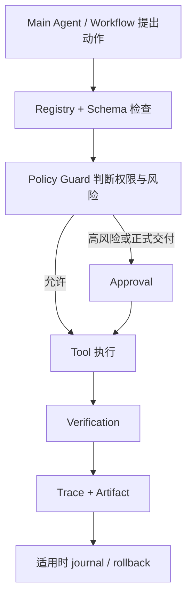

# LocalDesk

### A controlled local Office Agent for real desktop work

一个面向个人办公场景的本地 AI 助手：从自然语言任务出发，调用稳定 Workflow 和 Office Skills 完成真实办公产物，并通过受控 Runtime 提供权限、确认、验证、Trace 与恢复能力。

它的核心不是“让 Agent 看起来很自主”，而是：**办公任务能完成，正式动作可确认，结果可验证，过程可追溯。**

## 30 秒看懂 LocalDesk



一句话理解：Main Agent 像前台，负责听懂需求和分配任务；Workflow 像熟练员工，按稳定步骤办事；Runtime 像审批和审计制度，确保动作在边界内完成。

## Demo / Screenshot

```powershell
.\demo\run_showcase.cmd
```

随后打开 `.localdesk\demo-ui\index.html`。这个只读执行台会展示两次已经完成的真实任务：User Task、Main Agent Plan、Workflow、Tool Call、Approval、Artifact 和完整 Trace。

录制回放用于避免现场网络或 Office 环境波动，页面会明确标为 `Recorded real run`，不会冒充实时执行。完整讲解顺序见 [稳定演示手册](docs/demo_runbook.md)。



## 核心业务场景

| 场景 | 输入 | LocalDesk 的工作 | 真实交付 |
|---|---|---|---|
| AI 资讯周报 | 自然语言任务、冻结官方 RSS、时间窗 | 发现资讯、保存证据、跨来源整理、审查结论、生成周报 | PPTX、PDF、未发送 EML |
| 报销核对 | 支付流水 XLSX、发票 PDF、规则 DOCX | 匹配金额、发现异常、生成问题清单和摘要 | XLSX、PDF、未发送 EML |

AI 周报是主 Hero Demo，报销核对是稳定辅助 Demo；文件整理、UIA 和求职材料作为 Additional Capabilities，不与两条主线平均争夺注意力。

## Hero Demo 01：AI 资讯周报

用户说：“帮我整理本周 AI 资讯并生成 PPT。”

系统会在运行前冻结来源、时间窗和规则，由“大模型、Agent 产品、产业应用”三路职责并发读取官方 RSS/网页。每张资讯卡片保存发布日期、URL、引用片段、访问时间、内容哈希、摘要和价值判断。Editor 合并重复事件并排序，Memory 过滤历史事件，Reviewer 检查结论是否被证据直接支持，最后生成 PPTX、PDF 和未发送 EML，等待用户一次确认后交付。

一次保留的真实任务成功读取 OpenAI 官方 RSS，产生 30 条 Trace 并交付三份产物。正文页被 403 拒绝时，系统明确标记 `official_rss_item_fallback`，没有假装读到了正文。之后一次公网 TLS 超时也以失败任务留痕。

## Hero Demo 02：报销核对

用户说：“帮我核对这些报销材料。”

系统读取支付流水 XLSX、发票 PDF 和规则 DOCX，按金额上限与金额容差核对，生成正常项和待复核项，再输出 XLSX、PDF 和未发送 EML。保留的真实执行 Trace 包含 27 个事件、1 条正常项和 2 条待复核项，三份文件在一次人工确认后交付。

这个 Demo 使用合成输入，证明的是多文件读取、确定性核对和 Office 交付闭环，不代表真实企业财务规则覆盖。

## Additional Capabilities

- 文件整理：dry-run → 人工确认 → move → operation journal → 独立 rollback；
- Windows UIA：只在白名单测试窗口中执行结构化控件操作和状态验证；
- 求职材料：JD 与本地履历生成带来源的 DOCX 草稿；
- Office Skills：结构化读取或生成 XLSX、DOCX、PDF、PPTX 和 EML。

这些能力用于证明 Runtime 和 Office Skill 可以复用，不与两个核心 Demo 平均争夺产品主线。

## Architecture



| 设计 | 解决的问题 |
|---|---|
| Registry + Schema | 工具入口和参数形式不统一 |
| Policy Guard | 越权路径、未授权网页、Shell、删除或覆盖风险 |
| Staging + Approval | 用户没看过内容就发生正式副作用 |
| SHA-256 + Verification | 预览后文件被替换，或生成文件实际损坏 |
| Trace | Agent 说“完成了”，却无法复核做过什么 |
| Journal + rollback | 文件整理失败后无法恢复 |

固定 Workflow 和薄 Main Agent 共用这套 Runtime，因此以后增加规划能力时，不需要绕过已有安全边界。

为什么不使用完全开放的 Agent Loop？当前真正的难点是来源证据、Office 文件有效性和正式副作用，而不是长链规划。先用 Thin Agent + deterministic Workflow 保证真实任务稳定；只有后续任务出现明确 replan 需求时，才逐渐提高自主性。

一个实际例子：用户预览 PPT 后，如果 staging 文件在正式交付前被替换，Runtime 会重新计算 SHA-256 并阻止交付，而不是因为 Agent 已经说“完成”就继续执行。

## Demo UI

`localdesk.desktop.demo_ui` 把 `task.json` 和 `events.jsonl` 渲染成无后端、无依赖的静态页面。它重点展示 Agent 如何工作，而不是做复杂前端：

- 用户任务与 Main Agent 的 3～6 步计划；
- 六阶段执行进度；
- Workflow、Runtime、Artifact 三类 Trace 过滤；
- Approval 状态、产物类型和 SHA-256；
- 已知限制与原始 Trace payload；
- AI 周报和报销核对的稳定切换。

也可以直接渲染刚完成的本地 Task Trace：

```powershell
.\.venv\Scripts\python.exe -m localdesk.desktop.demo_ui render `
  --run "我的任务=<TASK_DIR>" `
  --output .localdesk\demo-ui\live.html
```

## 冻结评测

项目冻结了 18 条小型任务。每条任务都有明确输入、期望产物和确定性检查；语义质量允许人工抽查，不用 LLM-as-Judge 作为唯一裁判。

| 范围 | 当前结果 |
|---|---:|
| Main Agent 路由与拒绝 | 5/5 |
| 单路研究 / 三路并行 | 2/2 |
| Reviewer、Editor、Memory | 5/5 |
| Policy、Approval、Artifact、Verification、Trace | 6/6 |
| 合计 | 18/18 |

仓库锁定结果中，三路并行覆盖仍为 3/3，耗时从 126.968 ms 降至 42.331 ms，为串行的 2.999 倍；2026-08-16 的 release 重跑仍为 18/18，并发比为 2.912 倍。这里的 18/18 和并发比只代表冻结工程小样本，不是公开 Benchmark、真实公网吞吐或用户成功率。当前没有调用外部 LLM，因此 Token 和模型成本为 0；人工删除/修改数仍为 `null`，没有伪造用户反馈。

```powershell
.\.venv\Scripts\python.exe evaluation\run_product_evaluation.py `
  --manifest evaluation\product_tasks_v2.json `
  --output evaluation\results\product_eval_v2.json
```

任务定义、版本修正和全部结果见 [冻结评测报告](docs/product_eval_report_v2.md)。

## Quick Start

环境要求：Windows 10/11、Python 3.11+、[uv](https://docs.astral.sh/uv/)。稳定录制回放和冻结评测不需要外部 LLM API；完整 PPTX → PDF 实际生成需要 Microsoft PowerPoint，或安装 LibreOffice 作为回退。

```powershell
git clone https://github.com/qizhanggu/localdesk-office-agent.git
cd localdesk-office-agent
uv sync --frozen --cache-dir .uv-cache
.\demo\run_showcase.cmd
```

只查看 Main Agent 如何理解任务，不生成文件：

```powershell
.\.venv\Scripts\python.exe -m localdesk.desktop.main_agent_demo `
  --task "帮我整理本周 AI 资讯并生成 PPT" `
  --plan-only
```

运行真实来源周报：

```powershell
.\.venv\Scripts\python.exe -m localdesk.desktop.weekly_briefing_live_demo `
  --root .localdesk\weekly-live `
  --start 2026-07-20 `
  --end 2026-08-10
```

运行报销核对：

```powershell
.\.venv\Scripts\python.exe -m localdesk.desktop.reimbursement_demo --root .localdesk\reimbursement
```

以上两个 Demo 第一阶段只生成 staging、确认页和 Trace。用户检查后，再用原命令追加 `--confirm <TASK_ID>` 执行正式交付。系统不会自动发送邮件。

## Project Boundaries

- Main Agent 是确定性意图路由和短计划，不是开放式无限 replan；
- 三个 Research Agent 是确定性并发职责模块，不是三个真实 LLM；
- 联网研究只使用冻结官方 RSS/网页；正文失败时只能显式回退到官方 RSS 摘要；
- Editor 使用保守事件指纹和标题相似度，不宣称通用语义理解；
- Memory 保存历史事件、反馈和偏好，“持续追踪”尚未完成；
- Reviewer 能拦截明显的结论—证据不一致，不是完整事实核查器；
- OfficeBench 只完成了可行性和静态分析，没有公开 Benchmark 成绩；
- 不支持 arbitrary GUI、登录或 CAPTCHA、VLM 视觉导航、OCR；
- 不自动发送邮件，不允许任意 Shell、删除或覆盖用户文件。

## 阅读路线

- [当前产品架构](docs/current_architecture.md)：模块关系和技术取舍；
- [稳定演示手册](docs/demo_runbook.md)：5 分钟面试演示脚本；
- [面试讲解手册](docs/interview_guide.md)：常见追问与三条简历描述；
- [Phase 8 周报报告](docs/phase8_ai_weekly_briefing.md)：真实来源与 Office 交付证据；
- [冻结评测报告](docs/product_eval_report_v2.md)：18 条任务和结果边界；
- [Portfolio Release 验收](docs/portfolio_release_validation.md)：安装、测试、Demo、安全扫描和已知失败；
- [文档索引](docs/README.md)：当前文档与历史 archive 的清晰入口。

## 来源与独立改造范围

仓库基于 MewCode Python Coding Agent 学习型底座二次开发，不宣称全部从零实现。原始底座提供 Python Coding Agent 的 CLI、模型客户端和通用工具基础；LocalDesk 的独立改造主要集中在 `localdesk/desktop/` 的 Office/Runtime/Workflow、`evaluation/` 的冻结评测、`demo/` 的可重复演示，以及对应测试和产品文档。原始来源与历史归档均保留。
