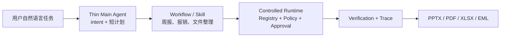

# LocalDesk Agent

LocalDesk 是一个面向个人办公场景的本地 AI 助手。用户用自然语言提出任务，系统生成一个短计划，选择已有办公 Workflow，并在受控 Runtime 中完成资料读取、文件生成、人工确认和正式交付。

它的定位不是“再做一套安全框架”，而是：**真正完成办公任务，同时默认可控、可审计、可确认、可验证、可恢复。**

## 当前可运行的产品能力

- 主 Hero Demo：AI 资讯周报。读取冻结白名单中的官方 RSS/网页，生成带证据的资讯卡片，再交付 PPTX、PDF 和明确标记为未发送的 EML 草稿。
- 辅助 Demo：报销核对。读取 XLSX 流水、发票 PDF 和确定性 DOCX 规则，输出问题清单 XLSX、PDF 和未发送 EML 草稿。
- 极简 Main Agent：自然语言 → intent → 3～6 步计划 → 选择现有 Workflow。它不是开放式无限规划 Agent。
- Runtime：Registry、Schema 检查、Policy Guard、Approval、Staging、SHA-256 复核、Verification、Trace、文件整理 journal/rollback。
- Office 工具：结构化读写 XLSX、DOCX、PDF、PPTX 和 EML；PPT/PDF 会进行结构及逐页渲染检查。

## 当前架构



详细架构见 [当前产品架构](docs/current_architecture.md)。

## 快速运行

先只看 Main Agent 如何理解任务，不生成文件：

```powershell
.\.venv\Scripts\python.exe -m localdesk.desktop.main_agent_demo --task "帮我整理本周 AI 资讯并生成 PPT" --plan-only
```

运行真实来源周报。来源集合和时间窗在运行前冻结；若网络或来源失败，任务会失败并保留证据，不会冒充成功：

```powershell
.\.venv\Scripts\python.exe -m localdesk.desktop.weekly_briefing_live_demo `
  --root .localdesk\weekly-live `
  --start 2026-07-20 `
  --end 2026-08-10

.\.venv\Scripts\python.exe -m localdesk.desktop.weekly_briefing_live_demo `
  --root .localdesk\weekly-live `
  --confirm <TASK_ID>
```

没有网络时，可运行明确标记为 `manual_public_snapshot` 的离线回退 Demo：

```powershell
.\.venv\Scripts\python.exe -m localdesk.desktop.weekly_briefing_demo --root .localdesk\weekly-offline
.\.venv\Scripts\python.exe -m localdesk.desktop.weekly_briefing_demo --root .localdesk\weekly-offline --confirm <TASK_ID>
```

运行报销核对：

```powershell
.\.venv\Scripts\python.exe -m localdesk.desktop.reimbursement_demo --root .localdesk\reimbursement
.\.venv\Scripts\python.exe -m localdesk.desktop.reimbursement_demo --root .localdesk\reimbursement --confirm <TASK_ID>
```

运行冻结的 18 条产品评测：

```powershell
.\.venv\Scripts\python.exe evaluation\run_product_evaluation.py `
  --manifest evaluation\product_tasks_v2.json `
  --output evaluation\results\product_eval_v2.json
```

最新冻结小样本结果为 18/18 通过；三路并行在受控延迟夹具中相对串行加速 2.999 倍。该数字只说明同一批确定性任务的工程行为，不代表公开 Benchmark 或真实用户成功率。详见 [评测报告](docs/product_eval_report_v2.md)。

导出真实资讯卡片的人审表：

```powershell
.\.venv\Scripts\python.exe evaluation\weekly_human_review.py export `
  --cards <TASK_DIR>\staging\news_cards.json `
  --output .localdesk\human-review\weekly-review.csv

.\.venv\Scripts\python.exe evaluation\weekly_human_review.py summarize `
  --review .localdesk\human-review\weekly-review.csv `
  --output .localdesk\human-review\weekly-review-summary.json
```

空白行不会计入用户反馈；没有完成任何评审时，`human_delete_or_modify_count` 保持 `null`。

## 真实性边界

- 三个 Research Agent 是按“大模型 / Agent 产品 / 产业应用”分工的确定性并发模块，不是三个真实 LLM。
- 当前联网研究使用冻结官方 RSS 和网页读取；正文页失败时，只允许使用带摘要的官方 RSS 条目，并标记为 `official_rss_item_fallback`。
- 摘要是证据片段的确定性截取，价值判断会明确提示人工判断；没有调用外部 LLM，因此 Token 和模型成本为 0。
- Editor 使用保守的事件指纹、标题相似度、证据状态和日期排序，不宣称通用语义理解。
- Memory 保存历史卡片、事件指纹、保留/删除反馈和分类偏好；“持续追踪”尚未完成。
- Reviewer 能检查证据字段及“标题/摘要是否能在引用片段中找到”，但不是完整的事实核查器。
- 系统不自动发送邮件，不支持任意 GUI、任意 Shell、删除或覆盖用户文件。
- OfficeBench 仅做过可行性与静态分析，未把它包装成已跑通的公开 Benchmark 成绩。

## 来源与独立改造范围

仓库基于 MewCode Python Coding Agent 学习型底座改造，原始代码和来源标注保留，不宣称从零开发。LocalDesk 的主要独立改造集中在 `localdesk/desktop/`、`evaluation/` 和对应测试、文档中。

文档入口见 [docs/README.md](docs/README.md)，面试时可直接对照 [面试讲解手册](docs/interview_guide.md)。
