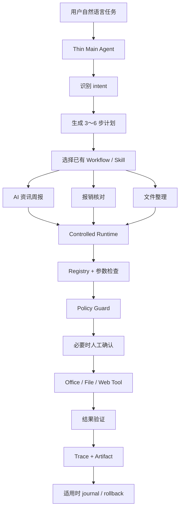
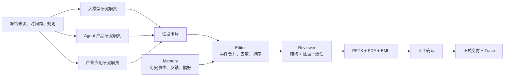

# LocalDesk 当前产品架构

## 一句话理解

Main Agent 像前台：听懂用户要办什么事并安排流程；Workflow 像熟练员工：稳定完成具体办公任务；Controlled Runtime 像公司的审批和审计系统：决定动作能不能做、是否要确认、结果是否真的完成。

## AI 周报链路

这里的三路“Agent”是并发职责模块：各自有可审计检索计划，但不调用 LLM。这样先验证多角色拆分、并发、证据链和失败处理是否值得，再决定是否引入模型。

## 关键模块

| 模块 | 做什么 | 当前边界 |
|---|---|---|
| `ThinMainAgent` | 从自然语言识别周报或报销任务，生成短计划 | 规则路由，无长链反思和无限 replan |
| `OfficialWeeklyResearch` | 读取冻结官方 RSS，筛选时间窗与关键词，尝试读取原文并保存证据 | 正文失败可显式回退到官方 RSS 摘要；不做开放搜索 |
| `WeeklyBriefingWorkflow` | 并发研究、编辑、Memory、Reviewer、Office 产物 | 摘要不由 LLM 生成 |
| `WeeklyBriefingMemory` | 保存卡片、事件指纹、反馈和分类偏好 | 尚无定时持续追踪 |
| `WeeklyBriefingReviewer` | 检查字段、时间、来源、证据支持和版式 | 只做确定性支持检查，不是完整语义事实核查 |
| `ArtifactBundleDelivery` | 把多份产物绑定成一次确认和交付 | 正式交付前复核路径、SHA-256 和文件结构 |
| `DesktopToolRegistry` | 统一工具入口 | Workflow 与未来动态 Agent 共用 |
| `DesktopPolicyGuard` | 判断权限和风险 | deny-first，不允许任意 Shell、删除、覆盖 |
| `TaskTraceStore` | 保存计划、来源、审批、执行、验证和交付事件 | JSONL，可回放但当前 UI 展示仍较基础 |

## 为什么不直接上复杂 Agent 框架

当前最大的风险不是“规划不够聪明”，而是资料来源、Office 产物和评测能否稳定闭环。先用薄 Main Agent 复用成熟 Workflow，能把失败定位在任务理解、研究、产物或 Runtime 中的具体一层。等真实任务证明短计划不够，再引入模型路由、replan 或更复杂框架。
