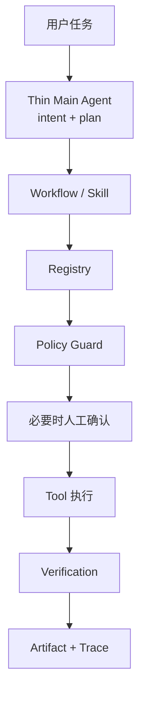

# LocalDesk 面试对照手册

> 使用方法：先记住 30 秒介绍和三个“问题 → 方法 → 结果”，面试官追问时再查后面的模块与问答。只讲有代码、Trace 或报告支持的内容。

## 30 秒介绍

> LocalDesk 是一个本地办公 Agent。用户可以直接说“帮我整理本周 AI 资讯并生成 PPT”或“帮我核对这些报销材料”，系统先识别任务并生成短计划，再调用稳定的 Workflow 读取本地文件或官方网页，真正生成 PPTX、PDF、XLSX 和邮件草稿。它和普通 Demo 的区别是，正式操作都经过权限检查、人工确认、结果验证和 Trace 记录；出错时不会假装成功。

## 两分钟主线

我一开始把 Runtime 做得比较完整，但遇到的问题是：安全模块很多，面试官仍然看不出用户到底能让产品完成什么任务。所以我把主线收紧成两个真实办公场景：AI 资讯周报作为 Hero Demo，报销核对作为辅助 Demo。

架构分三层：最上面是很薄的 Main Agent，只负责理解任务、生成 3～6 步计划并选择 Workflow；中间的 Workflow 负责稳定完成周报或报销；最下面的 Runtime 统一做工具注册、权限判断、人工确认、结果验证、Trace 和必要时的 rollback。

AI 周报会在运行前冻结来源、时间窗和规则，三路并发处理大模型、Agent 产品和产业应用资讯。每张卡片都保存 URL、引用片段、访问时间和内容哈希。Editor 做保守事件合并和跨周去重，Reviewer 检查结论有没有被引用片段直接支持，最后生成 PPTX、PDF、逐页渲染图、确认页和未发送 EML。一次真实运行成功读取 OpenAI 官方 RSS 并交付三份产物；正文页被 403 拒绝时，系统明确标成 RSS 回退，没有伪装成正文读取成功。

我还冻结了 18 条小型评测，覆盖路由、并发研究、证据篡改、Memory、权限拦截、人工拒绝、文件篡改和 Trace。v2 为 18/18；三路并行在同一组受控 I/O 夹具上相对串行快 2.999 倍。这个数字只代表冻结小样本，不冒充公开 Benchmark 或真实用户成功率。

## 主要架构



一句比喻：Main Agent 是前台，Workflow 是熟练员工，Runtime 是公司的审批和审计制度。

## 核心模块速查

| 模块 | 面试时怎么说 | 主要代码 |
|---|---|---|
| Thin Main Agent | 规则化识别周报/报销意图，输出短计划，复用已有 Workflow | `localdesk/desktop/main_agent.py` |
| Weekly Research | 冻结官方 RSS、按时间和关键词筛选、尝试读原文、保存证据和失败 | `localdesk/desktop/weekly_research.py` |
| Weekly Workflow | 三路并发、Editor、Memory、Reviewer、PPT/PDF/EML | `localdesk/desktop/weekly_briefing.py` |
| Reimbursement | 读取 XLSX、发票 PDF 和两个确定性规则，输出异常项 | `localdesk/desktop/reimbursement_workflow.py` |
| Artifact Bundle | 多产物一次确认；交付前复核 SHA-256 和文件结构 | `localdesk/desktop/artifact_bundle.py` |
| Registry | 所有工具统一走参数校验、Policy、执行和 Verification | `localdesk/desktop/registry.py` |
| Policy Guard | 拦截越权路径、未授权域名、delete、shell 和覆盖 | `localdesk/desktop/policy.py` |
| Trace | 用 task.json 与 events.jsonl 记录全过程 | `localdesk/desktop/trace_store.py` |

## 三个最值得讲的“坑”

### 1. Demo 能出文件，但研究证据是预置的

原因：原来的 `DEMO_SOURCES` 已经写好了标题、摘要和价值判断，三路 Research 只是并发处理这些数据。

方法：运行前冻结官方 RSS、时间窗、关键词和失败规则；保存访问时间、内容哈希、引用片段；正文失败只能显式使用官方 RSS 摘要。

结果：真实任务读到了官方 RSS 并交付 PPTX/PDF/EML；正文 403 和后来 TLS 超时都被 Trace 如实记录，没有伪造实时研究。

### 2. “三个 Agent”可能只是在名称上并行

原因：如果评测只看配置里有没有三个角色，即使一个角色没产出，也可能被误判为覆盖成功。第一版评测就出现了这个评分 Bug。

方法：v2 改成真正运行三个研究职责，并按实际卡片覆盖计分；冻结 18 条任务后全量重跑。

结果：串行和并行都覆盖 3/3，受控 I/O 夹具上并行耗时 42.331 ms、串行 126.968 ms，加速 2.999 倍。v1 保留但不用作结论。

### 3. 生成成功不等于交付安全

原因：用户预览后，staging 文件可能被替换；多份产物也可能只交付一半。

方法：把 PPTX/PDF/EML 或 XLSX/PDF/EML 绑定成 Artifact Bundle，确认时先检查全部文件的路径、SHA-256 和结构，再顺序执行。

结果：真实周报和报销任务都在一次确认后交付三份产物；冻结评测中的篡改 XLSX 在预检阶段被识别，任务失败且没有正式产物。当前不是跨文件系统事务，预检后的极端磁盘故障仍可能造成部分交付。

## 面试官可能问什么

### 这是真 Agent，还是固定脚本？

现在是“薄 Agent + 稳定 Workflow”。Main Agent 能从自然语言识别任务、生成计划并选择能力，但路由是确定性的；三路 Research 也没有调用 LLM。我没有把它包装成开放式自主 Agent。这样做是为了先把真实办公闭环和评测做稳。

### 为什么不直接上 LangGraph 或复杂 Multi-Agent？

当前瓶颈是来源可靠性、Office 产物和证据审计，不是长链规划。复杂框架会增加状态和调试成本，却没有解决已出现的问题。等真实任务出现需要 replan 的失败，再考虑引入。

### 三路 Research 的价值是什么？

一是职责隔离，来源和关键词可以分别审计；二是 RSS/网页读取属于 I/O 型任务，可以并行减少等待。冻结夹具验证了覆盖相同的情况下，三线程接近 3 倍加速。它目前不是为了展示 Agent 数量。

### RSS 回退算真实研究吗？

算真实公开来源读取，但不算原文阅读。系统真实读取了官方 RSS，并保存原始哈希和访问时间；正文 403 后只使用 RSS 自带摘要，卡片明确标记回退。面试时必须把这两层说清楚。

### Reviewer 怎么检查“结论—证据一致性”？

当前是保守的确定性检查：证据字段必须齐全，摘要必须能在引用片段中找到，标题至少有关键 token 被来源支持。它能拦截明显篡改，但不能判断复杂推理是否正确，所以我不会说已经完成完整事实核查。

### Editor 真的是语义去重吗？

不是通用语义模型。它用规范化事件 token、标题相似度和 URL 做保守合并，能处理标题换序和轻微改写。下一步应该用真实跨周样本测误合并和漏合并，再决定是否引入 embedding。

### Memory 到底记了什么？

记历史 `card_id`、事件指纹、相关 URL、用户 keep/delete 反馈和分类偏好。它能做跨周过滤，但没有后台定时抓取，所以不能说已经实现“持续追踪”。

### 为什么还要 LibreOffice？

Office 文件“能生成”不等于“能打开、版式正常”。LibreOffice 用于真实 DOCX/PDF 渲染，也作为 PPTX 转 PDF 的回退；有 PowerPoint 时优先用 COM。最终还会检查 PDF 页数和逐页 PNG。

### rollback 支持哪些操作？

目前明确支持文件整理 Workflow：dry-run 后移动，记录 operation journal，再通过独立确认回滚。不是每个 Office 任务都能 rollback；新生成的交付文件主要依靠 staging、确认和禁止覆盖来降低风险。

### 18/18 是否说明产品已经很好用了？

不能。18 条是冻结的小型工程评测，适合证明关键路径没有回归。语义质量仍需人工抽查，公网稳定性也不能由一次成功代表。报告把这些边界单独列出来了。

### 为什么没有换几个模型测试？

当前链路不依赖外部 LLM，所以 Token 和成本是 0。下一阶段如果有 API 和预算，我会固定同一批来源与证据，对比 1～2 个模型做“有证据摘要”，统计证据支持率、人工修改数、延迟、Token 和成本；不会为了结果好看换题或改规则。

### 人工删除和修改数为什么还是空的？

因为还没有真实用户完成 10～20 张卡片抽查。我已经实现可复现抽样、空白评审表和统计脚本，但空白表只会输出 `null`，不能拿工具存在冒充用户反馈。当前真实 Demo 只有 3 张卡片，样本量也没有达到冻结目标。

## 自己怎么演示

最稳定的方式是先回放两次已完成任务的真实 Trace：

```powershell
.\demo\run_showcase.cmd
```

页面能切换 AI 周报和报销核对，并按 Plan、Workflow、Approval、Artifact、Trace 的顺序展示全过程。它是只读历史回放，会明确标记，不冒充实时执行。

只看计划：

```powershell
.\.venv\Scripts\python.exe -m localdesk.desktop.main_agent_demo --task "帮我核对这些报销材料" --plan-only
```

运行真实周报：

```powershell
.\.venv\Scripts\python.exe -m localdesk.desktop.weekly_briefing_live_demo --root .localdesk\weekly-live --start 2026-07-20 --end 2026-08-10
```

运行评测：

```powershell
.\.venv\Scripts\python.exe evaluation\run_product_evaluation.py --manifest evaluation\product_tasks_v2.json --output evaluation\results\product_eval_v2.json
```

## 三条简历候选描述

1. 针对办公 Agent “能生成文件但来源不可审计”的问题，设计冻结官方 RSS/网页研究链路，为资讯卡片绑定 URL、引用片段、访问时间和内容哈希，并加入确定性证据一致性 Reviewer；真实 Demo 完成官方 RSS 读取及 PPTX/PDF/未发送 EML 的确认式交付，正文 403 与网络超时均在 Trace 中诚实留痕。

2. 针对固定 Workflow 缺少自然语言入口、复杂 Agent Loop 又易失控的问题，实现轻量 Main Agent，将用户任务映射为 intent、3～6 步计划和既有 Workflow；冻结 18 条产品评测覆盖路由、证据、Memory、Policy、Verification 与 Trace，v2 全量 18/18 通过。

3. 针对多角色研究“只有架构名词、没有收益证据”的问题，构建同源同任务的串行/三线程对照，并修复首版覆盖评分只看角色配置的实验缺陷；在 3/3 有效资讯覆盖不变的受控 I/O 夹具上，将延迟从 126.968 ms 降至 42.331 ms，获得 2.999 倍加速。

## 绝对不要说过头

- 不说“三个 LLM Agent”，应说“三个确定性并发研究职责模块”；
- 不说“实时 Deep Research”，应说“冻结官方 RSS/网页读取，允许明确 RSS 回退”；
- 不说“完整语义事实核查”，应说“确定性证据支持检查”；
- 不说“Memory 持续追踪”，应说“历史事件与反馈存储、跨周过滤”；
- 不说“公开 Benchmark 18/18”，应说“自建冻结小型评测 18/18”。
